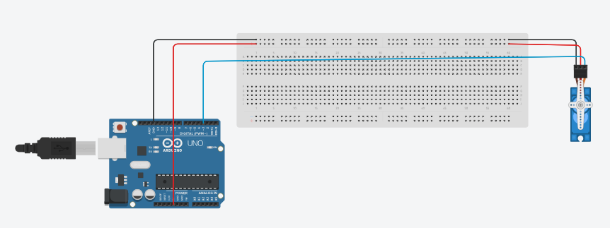
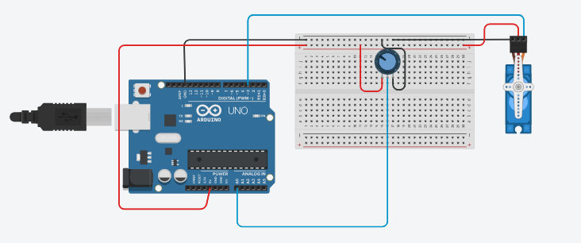

# Task2-Electronics


## Servo Motor

 ### Definition:
  A Servo Motor is a small device that has an output shaft. This shaft can be positioned to specific angular positions.

 ### Hardware Required:
  - Arduino UNO.
  - Breadboard.
  - Servo Motor.
  - 10k ohm potentiometer
  - hook-up wires.

  ### Circuits:

   

    
   
   #### - Sweep Circuit
    


  ### Code:

  #### - Knob Code

```
#include <Servo.h>

Servo myservo;  // create servo object 


int position = 0;   //  servo position

void setup() {
  myservo.attach(3);  // attaches the servo on pin 3 
}

void loop() {
  
   // goes from 0 degrees to 180 degrees
  for (position = 0; position <= 180; position += 1) {
    
    myservo.write(position);              
    delay(15);                       
  }
  
  
  // goes from 180 degrees to 0 degrees
  for (position = 180; position >= 0; position -= 1) { 
    myservo.write(position);              
    delay(15);                       
  }
}
  
```

 #### - Sweep Code

 ```

#include<Servo.h> 

Servo myservo; // create servo object

int position=0; //  servo position

int v; // To store value of the potentiometer

void setup()
{
  myservo.attach(3);
}

void loop()
{
  v = analogRead(position);           
  v = map(v, 0, 1023, 0, 180); 
  myservo.write(v);                  
  delay(15); 
}

 ```

  ### Tinkercad link:

  #### - Knob
  https://www.tinkercad.com/things/bd6KAW0pPJU?sharecode=dfLSPfnHgv3nyEK807E_W-9VUNXNTrZrRVU1_D7EC-s

  #### - Sweep 
  https://www.tinkercad.com/things/kFHIBqkXhlU?sharecode=mrEgE3dCBqDUGgsMTksFGjumzsR0a--6H39O97ehPVE
  
      
